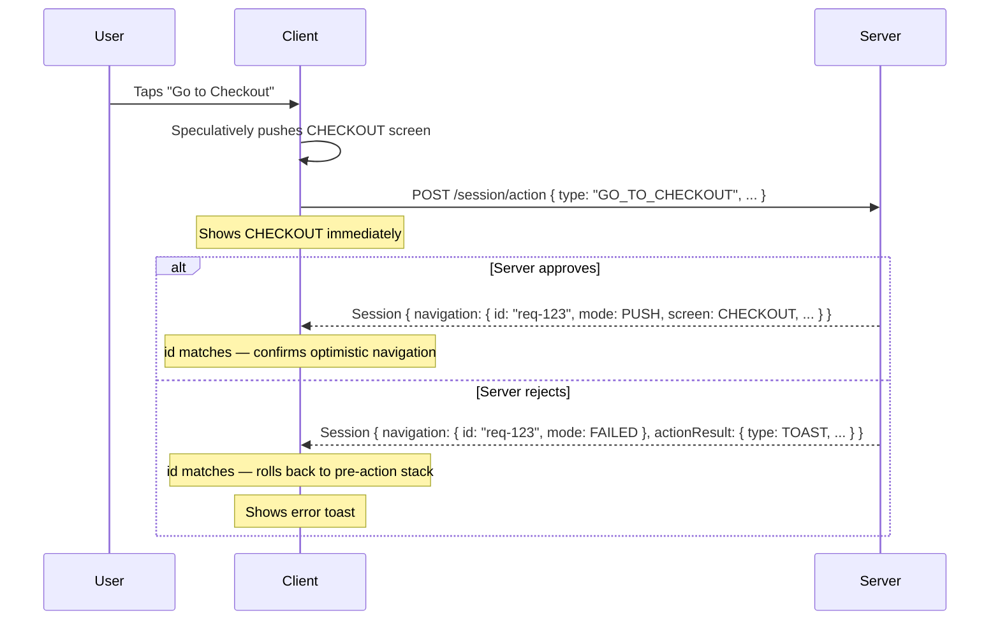

# Optimistic Navigation

Optimistic navigation is a pattern where the client speculatively applies a navigation directive before the server responds, then either confirms or rolls it back once the response arrives. It reduces perceived latency on actions that are very likely to succeed.

## How it works

When the user performs a navigation action (e.g. tapping "Go to Checkout"), the client can push the target screen immediately without waiting for the server. The action request is sent in parallel. When the server responds:

- If navigation **succeeds** — the server returns a matching navigation directive; the client confirms the already-applied change
- If navigation **fails** — the server returns `mode: FAILED`; the client rolls back the stack to its pre-action state

The `id` field in the navigation directive is the key to this mechanism. The client matches the server's response `id` to the pending optimistic navigation it applied, so it knows exactly which speculative change to confirm or undo.

## When to apply optimistically

Optimistic navigation works best on actions where failure is rare and the cost of a rollback (brief flicker back) is acceptable.

**Good candidates:**
- Simple screen transitions triggered by user intent (tapping a product card, opening a cart)
- Navigation to screens the user explicitly requested

**Avoid optimistic navigation for:**
- Payment or order submission actions — failure is meaningful and should not be pre-empted
- Form submissions — errors are common and should be handled in-place
- Actions with significant side effects — rollback feels jarring if the user saw a confirmation

## Rules

- The client **MAY** apply navigation optimistically on `PUSH`, `REPLACE`, and `RESET` modes
- The client **MUST** roll back the navigation stack when the server returns `mode: FAILED`
- The client **MUST NOT** apply `POP` optimistically — the server may include additional state changes (meta patch, component updates) that must be processed first
- The server **MUST** include a `Navigation.id` in every directive to support rollback matching

## Relationship to the FAILED mode

`FAILED` is not only used for optimistic rollback — the server may also return it when a navigation cannot proceed for any reason, even if the client did not apply the navigation optimistically. In that case, the client simply stays on the current screen.

See [Stack Modes](../protocol/navigation/stack-modes#failed) for the full `FAILED` mode specification.
