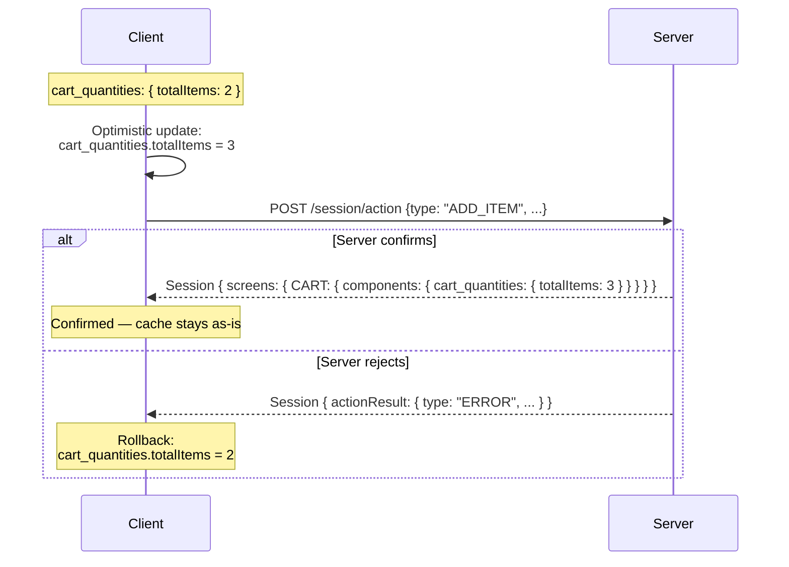

# Sharing Global State

Some UI state needs to be visible across multiple components on a screen — for example, a cart item count that appears in both the app bar and a floating checkout button. In RUF, this presents a challenge: the client cannot mutate [SessionMeta](../protocol/constructs/session-meta) directly, so how can the UI reflect optimistic changes before the server responds?

## The problem

Consider a user tapping a "+" button to increase a product quantity. The action is dispatched to the server, but there may be a short delay before the response arrives. The user expects immediate feedback.

The naive solution would be to mutate `meta.cartItemCount` directly on the client. But this violates the protocol's core rule: **only the server may mutate SessionMeta**.

## The state-holding component pattern

The solution is to introduce a dedicated component whose sole purpose is to hold shared state. Instead of storing shared state in `meta`, the server sends it as a component — and the client can update that component optimistically.

For example, a `cart_quantities` component might look like:

```json
{
  "rel": "cart_quantities",
  "behavior": "VISIBLE",
  "locale": {},
  "payload": {
    "totalItems": 3,
    "totalPrice": 49.90
  }
}
```

Any component on the screen that needs to display cart state reads from `cart_quantities` instead of from `meta`.

## How optimistic updates work with this pattern

When the user taps "+" to add an item:

1. The client dispatches the action to the server
2. **Optimistically**, the client updates the `cart_quantities` component in its local cache — incrementing `totalItems` by 1 and adjusting `totalPrice`
3. The server responds with the authoritative `cart_quantities` component
4. The client replaces its optimistic version with the server's confirmed version

If the server rejects the action, the client rolls back the optimistic component update — restoring the previous cache state.



## Key insight

The rule is: **the client derives all state from components, not from meta**. Meta is for server-side decision making — it travels with every request so the server has full context. Components are for the client's rendering layer. Keeping these roles separate is what makes the pattern work.

## When to use this pattern

Use a state-holding component when:

- Multiple components on the same screen need to display the same derived state
- That state may need to be updated optimistically
- The state changes as a result of user actions on that screen

If state only needs to be reflected after the server confirms (no optimistic update needed), no special pattern is required — the server simply updates the relevant components in its response.
