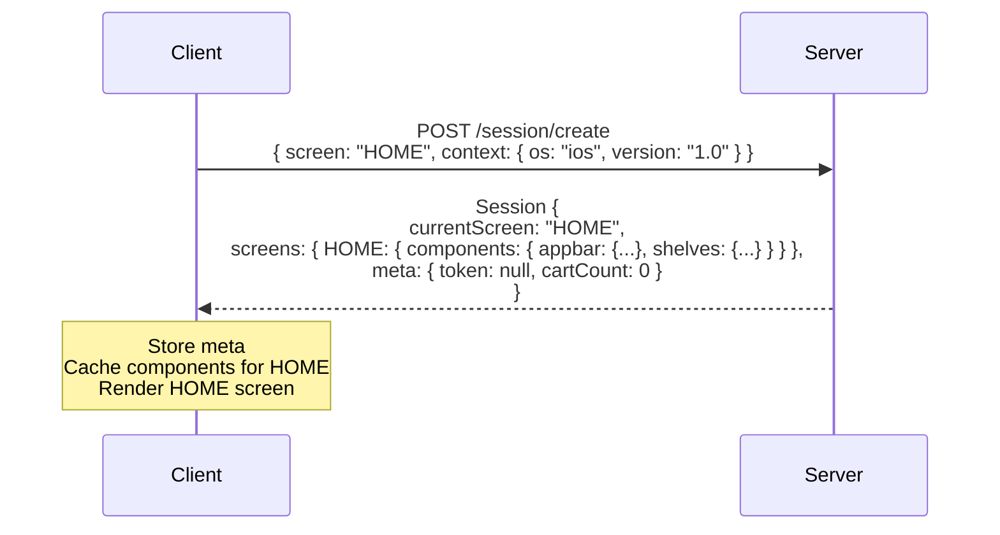
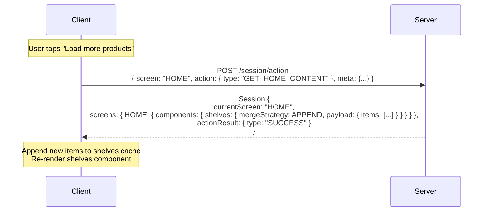
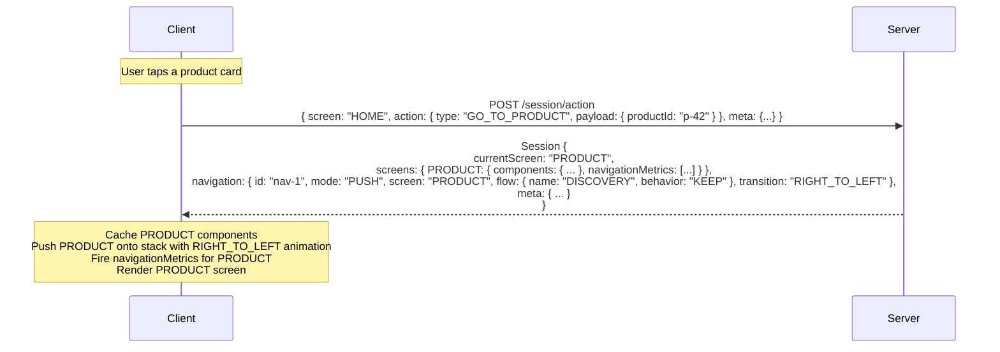
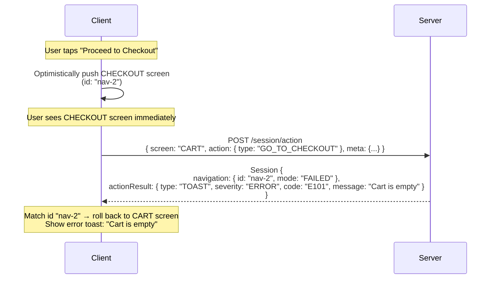
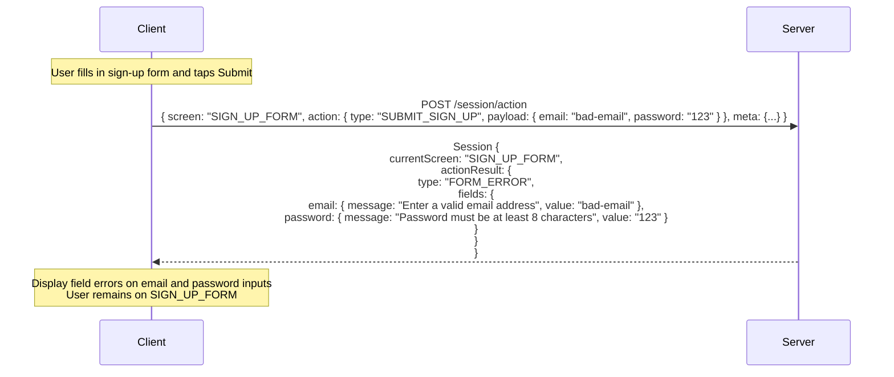

# Example Flows

Concrete sequence diagrams for common RUF interaction patterns.

---

## 1. App startup

The application starts, creates a session, and renders the first screen.

---

## 2. Simple action — component update

The user taps a button that triggers a server action. The server responds with updated components on the same screen.

---

## 3. Navigation — go to a new screen

The user triggers an action that navigates to a different screen.

---

## 4. Optimistic navigation + rollback

The client applies navigation speculatively. The server rejects it and the client rolls back.

---

## 5. Form submission with validation errors

The user submits a form. The server returns field-level validation errors.

