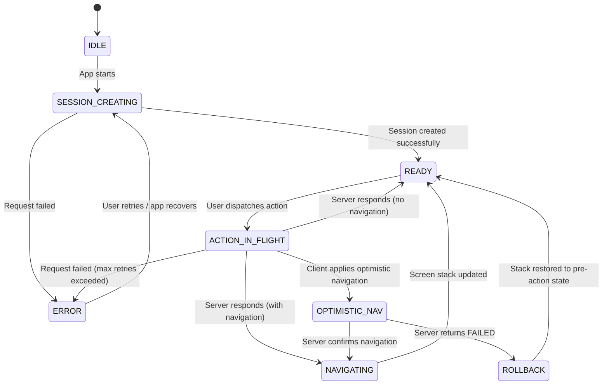

# Protocol State Machine

This diagram shows the states a RUF client moves through during the application lifecycle.

## State descriptions

| State | Description |
|---|---|
| `IDLE` | Application not yet started |
| `SESSION_CREATING` | `/session/create` request in flight |
| `READY` | Session active, UI rendered, awaiting user input |
| `ACTION_IN_FLIGHT` | `/session/action` request in flight |
| `OPTIMISTIC_NAV` | Action in flight, client has speculatively applied a navigation directive |
| `NAVIGATING` | Server confirmed navigation; client is updating the screen stack |
| `ROLLBACK` | Server returned `FAILED`; client is restoring pre-action stack state |
| `ERROR` | Unrecoverable error — network failure after retries, or fatal server error |

## Notes

- The client can only be in one state at a time.
- Multiple actions may be queued, but only one is `in_flight` at a time. A queue implementation may cancel previous in-flight actions if a newer action supersedes them.
- The `READY` state is the steady state — the application spends most of its time here, waiting for the next user interaction.
- `ERROR` is a terminal state that typically requires user action (e.g. a retry button) or an app restart to recover from.
