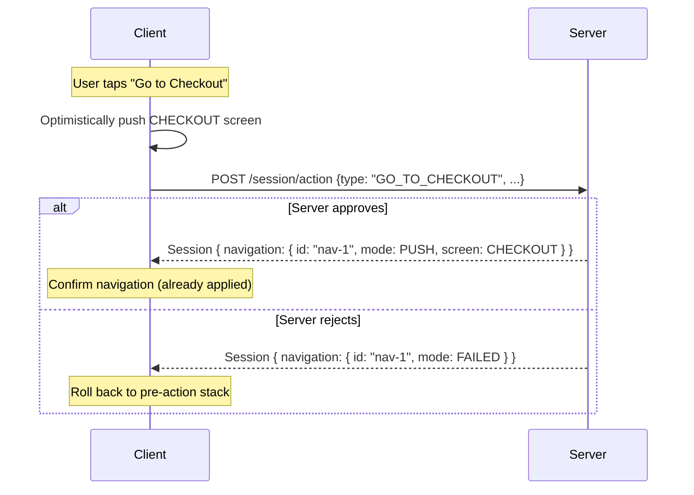

# Navigation

A Navigation directive is a server instruction to the client describing how to update the screen stack. It is included in the Session response when the server wants the client to transition to a new state.

## Sub-constructs

| Sub-construct | Description |
|---|---|
| **id** | A unique identifier for this navigation directive. Used for idempotency and to match optimistic navigations with their server response for potential rollback. |
| **mode** | How the screen stack should be modified. See [Stack modes](#stack-modes). |
| **screen** | The target screen name. Required for all modes except `POP` and `FAILED`. |
| **screenParams** | Optional typed parameters to pass to the target screen. |
| **transition** | The page animation to use for this transition. Overrides the screen's default transition. |
| **flow** | Describes the logical flow context of this navigation. See [Flow](#flow). |

## Stack modes

| Mode | Description |
|---|---|
| `PUSH` | Add the target screen to the top of the navigation stack. |
| `REPLACE` | Remove the current top screen and push the target screen in its place. |
| `RESET` | Clear the entire navigation stack and push the target screen as the new root. |
| `POP` | Remove the top screen from the stack, going back to the previous screen. |
| `FAILED` | The navigation could not be completed. The client **MUST** roll back the stack to its state before the action that triggered this navigation. |

## Flow

The `flow` field groups screens into named logical flows (e.g. `AUTH`, `CHECKOUT`, `DISCOVERY`). The `behavior` field controls how the stack is managed when entering a flow.

| Behavior | Description |
|---|---|
| `START_NEW` | Remove any screens belonging to the same flow from the stack before pushing the new screen. Useful for starting a flow fresh. |
| `KEEP` | Maintain the existing stack. The new screen is added without modifying previous flow history. |
| `REMOVE_PREVIOUS` | Remove the immediately previous screen in the same flow. Useful for replacing a step within a flow without building up stack history. |

## Screen transitions

The `transition` field specifies the animation used when the screen change occurs. Available values:

| Direction | Variants |
|---|---|
| Horizontal | `LEFT_TO_RIGHT`, `LEFT_TO_RIGHT_POP`, `LEFT_TO_RIGHT_FADE`, `LEFT_TO_RIGHT_JOINED` |
| Horizontal (reverse) | `RIGHT_TO_LEFT`, `RIGHT_TO_LEFT_POP`, `RIGHT_TO_LEFT_FADE`, `RIGHT_TO_LEFT_JOINED` |
| Vertical (down) | `TOP_TO_BOTTOM`, `TOP_TO_BOTTOM_POP`, `TOP_TO_BOTTOM_JOINED` |
| Vertical (up) | `BOTTOM_TO_TOP`, `BOTTOM_TO_TOP_POP`, `BOTTOM_TO_TOP_JOINED` |
| Neutral | `FADE`, `SCALE` |

## Optimistic navigation

The client **MAY** apply a navigation directive speculatively before the server responds, to improve perceived responsiveness. This is called optimistic navigation.

If the server returns `Navigation.mode = FAILED`, the client **MUST** roll back the navigation stack to its state before the action was dispatched. The `id` field allows the client to match the server's `FAILED` response to the correct optimistic navigation in its stack.

