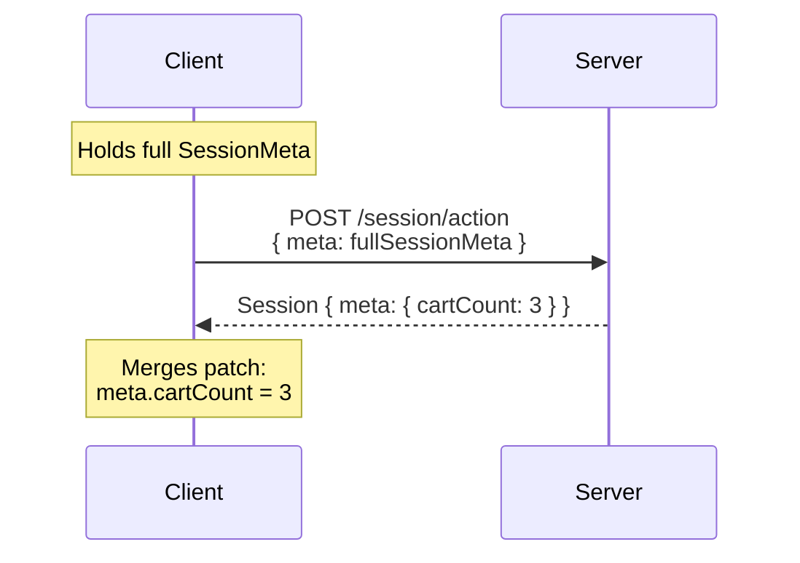

# SessionMeta

SessionMeta is the application's mutable state. It is the shared memory between the client and server across the entire session lifetime.

## Role in the protocol

The client holds a local copy of SessionMeta and sends it with every action request. The server reads it to make decisions, then returns a partial patch with only the fields that changed. The client merges this patch into its local copy.



## The server-only mutation rule

The client **MUST NOT** mutate SessionMeta directly. Only the server is allowed to change state.

This is a foundational rule of the protocol. It ensures:

- **Predictability** — state transitions happen in one place, under server control
- **Auditability** — every state change corresponds to an explicit server response
- **Consistency** — the server always has the full picture when deciding what state to return

When the client needs to reflect state changes before the server responds (e.g. updating a cart quantity counter immediately on tap), it does so through a dedicated [state-holding component](../../common-patterns/sharing-global-state), not by patching meta directly.

## Shape

The shape of SessionMeta is defined per application. The protocol does not mandate specific fields — each project defines what its session needs to carry.

At minimum, a SessionMeta should contain enough information for the server to reconstruct the full application state from a cold start, including any user authentication tokens, selected context (e.g. current address, store, or tenant), and in-progress flow state.

The protocol reserves one implicit field on every SessionMeta:

| Field | Type | Description |
|---|---|---|
| `version` | `number` | Tracks the meta schema version. Managed by the protocol — do not declare it in the spec YAML. |

When the server receives a persisted meta with an outdated `version`, it runs migration updaters to bring it up to the current shape before use. See [SessionMeta Versioning](../versioning/session-meta-versioning).

## Persistence

The client should persist SessionMeta across app restarts. When the app relaunches, the client may send the saved meta as `previousSessionMeta` in the [/session/create](../api-contract) request, allowing the server to restore the appropriate state and screen.

## Merging patches

The server returns `Partial<SessionMeta>` — only the fields that changed. The client merges these fields into the local copy via shallow merge:

```
newMeta = { ...currentMeta, ...responseMeta }
```

Nested objects within meta are fully replaced, not deep-merged, unless the implementation explicitly defines otherwise.
