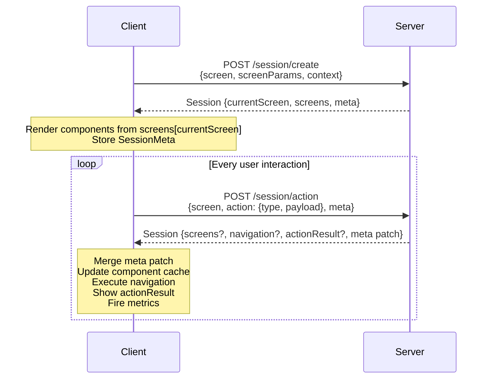

# Protocol Lifecycle

RUF is built around two HTTP endpoints. Every interaction in the application maps to one of them.

## The two-request lifecycle

### 1. Session creation

When the application starts, the client creates a session by declaring the initial screen and its parameters, along with context about the device and environment.

```http
POST /session/create
```

The server responds with a full [Session](./constructs/session) containing the first screen's components, the initial [SessionMeta](./constructs/session-meta), and any navigation directives.

### 2. Action execution

From this point forward, every user interaction is an [Action](./constructs/action) dispatched to the server. The client sends the current screen name, the action type and payload, and the full current SessionMeta.

```http
POST /session/action
```

The server processes the action, transitions state, and returns an updated Session. This cycle repeats for the lifetime of the application.

## Sequence diagram



## State flow between requests

The client maintains a local copy of [SessionMeta](./constructs/session-meta) for the entire session lifetime. On every action request, the full SessionMeta is sent back to the server. This allows the server to make decisions based on the current application state without requiring server-side session storage.

The server returns only a `Partial<SessionMeta>` in each response — a patch containing only the fields that changed. The client applies this patch via a shallow merge on top of the existing meta.

## Session restore

When an application restarts, the client may send the previously persisted SessionMeta as `previousSessionMeta` in the create request. This allows the server to restore the appropriate screen and state rather than starting fresh.

This is an application-level pattern, not a formal protocol guarantee — whether and how the server honors a previous session is up to the implementation.

## Partial responses

The server does not need to return all screens or all components on every response. It returns only what changed. The client is responsible for maintaining a component cache and merging new data into it using each component's [merge strategy](./constructs/component#mergestrategy).
