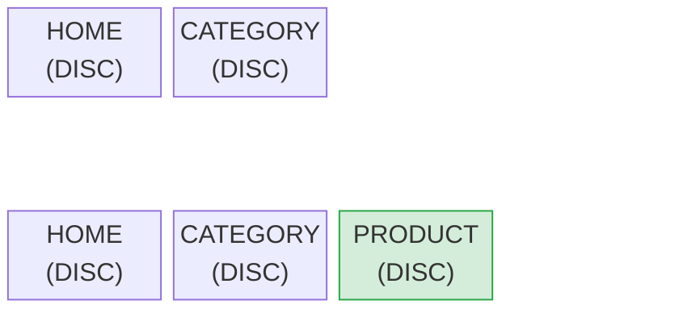
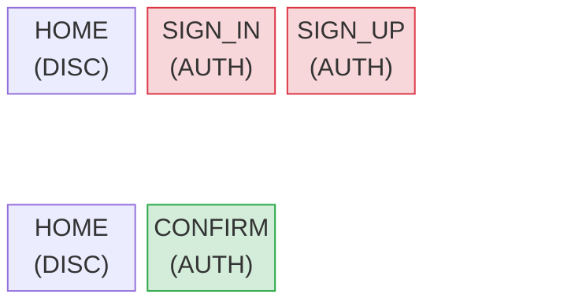
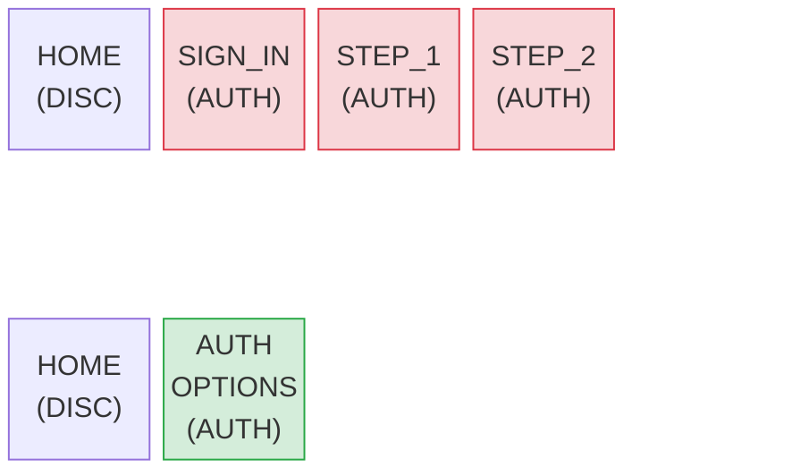

# Flows

A flow is a named group of screens that form a logical sequence — for example, `CHECKOUT`, `DISCOVERY`, or `AUTH`. Flows allow the server to instruct the client to remove an entire group of screens from the stack when a flow ends or restarts, without needing to know the exact stack state.

## How flows work

Every navigation directive that carries a destination includes a `flow` object:

```json
{
  "mode": "PUSH",
  "screen": "PRODUCT",
  "flow": {
    "name": "DISCOVERY",
    "behavior": "KEEP"
  }
}
```

The client records the flow context of each screen it pushes. When a new navigation arrives, the `behavior` field tells the client how to manipulate existing flow screens before applying the new navigation.

Flow behavior is **executed entirely by the client**. The server sends a directive; the client applies it to its local stack.

## Declaring flows in the spec YAML

Flows are declared per screen in the spec YAML. Each screen lists which flows it belongs to. A screen may belong to no flows, one flow, or multiple flows.

```yaml
screens:
  CART:
    flows:
      - CHECKOUT
    components: [...]

  CHECKOUT:
    flows:
      - CHECKOUT
    components: [...]

  PAYMENT_METHODS:
    flows:
      - CHECKOUT
    components: [...]

  CATEGORY:
    flows:
      - DISCOVERY
    components: [...]

  PRODUCT:
    flows:
      - DISCOVERY
    components: [...]

  SIGN_IN:
    flows:
      - AUTH
    components: [...]

  SIGN_UP_FORM:
    flows:
      - AUTH
    components: [...]
```

## Flow behaviors

### KEEP

Push the new screen onto the stack without removing any existing screens.



**Before:** `[HOME(DISC), CATEGORY(DISC)]`  
**Action:** PUSH PRODUCT — flow=DISCOVERY, behavior=KEEP  
**After:** `[HOME(DISC), CATEGORY(DISC), PRODUCT(DISC)]`

Use `KEEP` when navigating forward within a flow and the user should be able to go back through previous screens. This is the most common behavior for exploration flows like product browsing.

---

### REMOVE_PREVIOUS

Remove **all screens in the named flow** from the stack, then push the new screen.



**Before:** `[HOME(DISC), SIGN_IN(AUTH), SIGN_UP_FORM(AUTH)]`  
**Action:** PUSH CONFIRM_PHONE — flow=AUTH, behavior=REMOVE_PREVIOUS  
**After:** `[HOME(DISC), CONFIRM_PHONE(AUTH)]`

Use `REMOVE_PREVIOUS` when transitioning between steps in a flow where the completed steps should not be in the back stack. The user cannot navigate back to the removed screens.

---

### START_NEW

Like `REMOVE_PREVIOUS`, but the new screen becomes the **first** (root) screen of the flow — effectively resetting the flow.



**Before:** `[HOME(DISC), SIGN_IN(AUTH), STEP_1(AUTH), STEP_2(AUTH)]`  
**Action:** PUSH AUTH_OPTIONS — flow=AUTH, behavior=START_NEW  
**After:** `[HOME(DISC), AUTH_OPTIONS(AUTH)]` — AUTH_OPTIONS is now the flow root

Use `START_NEW` when restarting an entire flow from scratch — for example, the user abandons a multi-step process and the server needs to bring them back to the flow entry point.

## Summary

| Behavior | Removes existing flow screens? | New screen position |
|---|---|---|
| `KEEP` | No | Added on top of existing flow screens |
| `REMOVE_PREVIOUS` | Yes — all screens in the flow | Becomes the next screen in the flow |
| `START_NEW` | Yes — all screens in the flow | Becomes the first (root) screen of the flow |
