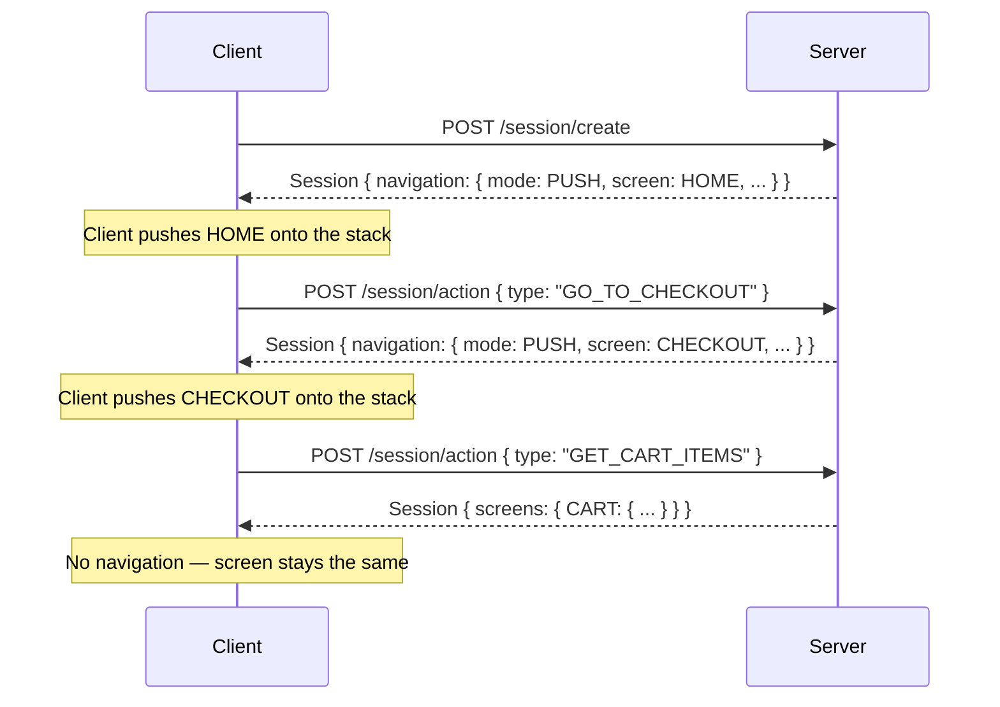

# Navigation Overview

A Navigation directive is a server instruction telling the client how to update its screen stack. The server includes it in a Session response whenever it wants the client to transition to a new state.

Navigation is **optional** — its absence means the current screen stays active. The server sends at most one navigation directive per response.

## When navigation appears

Navigation directives can appear in responses from both endpoints:

## Field reference

| Field | Type | Present when | Description |
|---|---|---|---|
| `id` | `string` | always | Identifier for this directive. The client uses it to match a server response to a pending optimistic navigation for confirmation or rollback. See [Optimistic Navigation](../../common-patterns/optimistic-navigation). |
| `mode` | enum | always | The stack operation to perform. See [Stack Modes](./stack-modes). |
| `screen` | `string` | PUSH, REPLACE, RESET | The target screen name. |
| `flow` | `{ name, behavior }` | PUSH, REPLACE, RESET | The logical flow context for this navigation. See [Flows](./flows). |
| `transition` | enum | optional | Page animation for this transition. Overrides the client's default. See [Transitions](./transitions). |
| `screenParams` | `object` | screen-dependent | Typed parameters for the target screen. Required when the target screen mandates params. |

### Why `screenParams` are in the navigation directive

The server may navigate the client to a screen it did not explicitly request — for example, an action that resolves to a different destination based on server-side state. Since the client may not have prepared params for this destination, the server includes them in the directive. Params also enable the client to refresh the screen later without losing context.

## Mode constraints

`POP` and `FAILED` carry only the `id` and `mode` fields. They do not carry `screen`, `flow`, or `transition`:

| Modes | Has `screen` / `flow` / `transition`? | Why |
|---|---|---|
| `PUSH`, `REPLACE`, `RESET` | Yes | The client needs to know where to navigate and which flow context to apply |
| `POP` | No | The destination is the previous screen — the client already knows it |
| `FAILED` | No | There is no destination. The client restores the stack to its pre-action state. |
