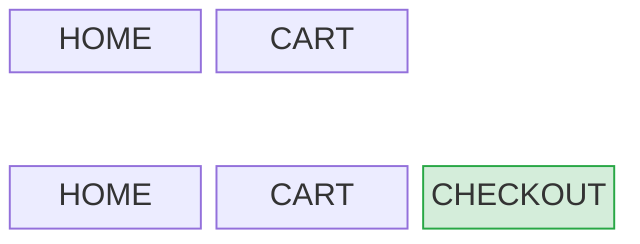
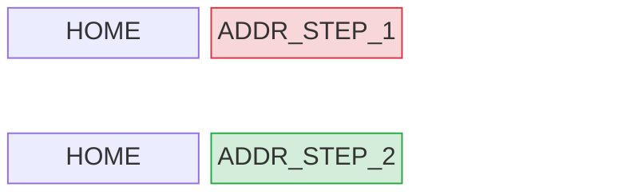
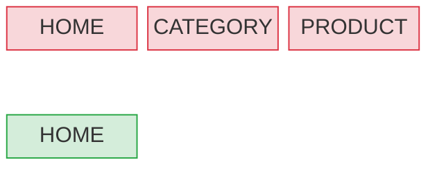
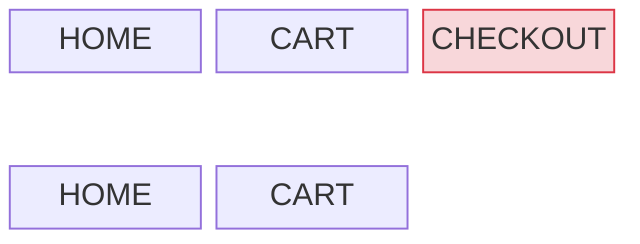

# Stack Modes

The `mode` field in a navigation directive specifies how the client should modify its screen stack. There are five modes.

---

## PUSH

Adds the target screen to the top of the navigation stack.

**Before:** `[HOME, CART]`  
**After:** `[HOME, CART, CHECKOUT]`

Use when the user is moving forward to a new screen within or across flows. The previous screen remains on the stack — the user can go back to it.

---

## REPLACE

Removes the current top screen and pushes the target in its place.

**Before:** `[HOME, ADDR_STEP_1]`  
**After:** `[HOME, ADDR_STEP_2]`

Use for step-by-step flows where completing a step should replace it with the next one. Prevents the user from navigating back to a step that no longer makes sense.

---

## RESET

Clears the entire navigation stack and pushes the target screen as the new root.

**Before:** `[HOME, CATEGORY, PRODUCT]`  
**After:** `[HOME]`

Use for top-level navigation changes where the user's previous journey is no longer relevant — for example, after sign-in completes, or when handling a deep link that lands the user in a completely different context.

---

## POP

Removes the top screen from the stack, going back to the previous screen.

**Before:** `[HOME, CART, CHECKOUT]`  
**After:** `[HOME, CART]`

Use when the server wants to explicitly dismiss the current screen — for example, after completing a step or when a recoverable error should return the user to the previous context.

`POP` carries no `screen`, `flow`, or `transition` fields. The destination is always the previous screen, which the client already knows.

---

## FAILED

Signals that a navigation could not be completed. The client **MUST** roll back the stack to its state before the action that triggered this directive.

`FAILED` carries no `screen`, `flow`, or `transition` fields. There is no destination — the client restores, not navigates.

This mode is used in conjunction with optimistic navigation: the client may have speculatively applied a navigation, and `FAILED` tells it to undo that. See [Optimistic Navigation](../../common-patterns/optimistic-navigation) for the full rollback flow.
