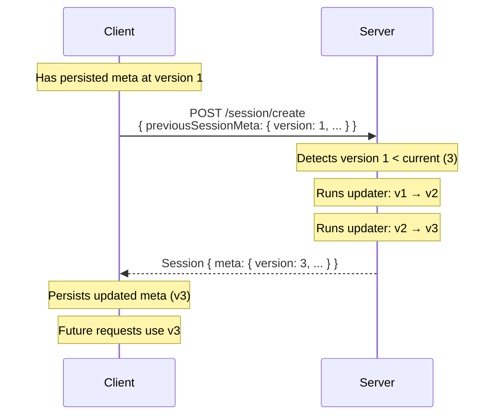

# SessionMeta Versioning

SessionMeta carries the application's mutable state across the session lifetime. As the application evolves, the shape of this state may need to change — new fields added, old ones removed, types updated. SessionMeta versioning handles the migration of stored meta from an older shape to the current one.

## How it works

SessionMeta contains a reserved `version` field (an integer) managed by the protocol. This field is implicit — it does not appear in the spec YAML's `meta:` definition, but it is always present in the persisted meta.

When the client sends a session request with a persisted `previousSessionMeta`, the server checks `meta.version` against the current expected version:

- If they match, the meta is used as-is
- If the stored version is lower, the server runs **updater functions** chained in sequence until the meta reaches the current version



Each updater function takes the meta at version N and produces meta at version N+1. Updaters may also choose to rebuild the meta entirely from scratch rather than incrementally patching.

The upgraded meta is returned in the session response and persisted on the client. All subsequent requests from that point forward will carry the new version.

## Declaring historical shapes in the spec YAML

The `meta:` section supports a `versions:` map for documenting the shape at each historical version. This enables tooling (e.g. code generators) to produce the updater functions automatically.

```yaml
meta:
  token?: string
  cartCount: number
  selectedAddress?:
    id: string
    label: string

  versions:
    "1":
      token?: string
      # cartCount was not present in v1
      # selectedAddress was not present in v1
    "2":
      token?: string
      cartCount: number
      # selectedAddress was not present in v2
```

The top-level `meta:` shape is the current version. Each entry under `versions:` describes the full shape at that historical version.

## When to version SessionMeta

Version the meta when you need to add or remove fields, or change the type of an existing field. Common triggers:

- A new piece of application state is introduced (e.g. adding a `loyaltyPoints` field)
- An old field is removed and the server no longer returns it
- A field's structure changes (e.g. `selectedAddress` was a `string`, now it's an object)

:::caution Code smell
If your application is incrementing the SessionMeta version frequently, this is a signal that the meta shape is unstable. A well-established application rarely needs to migrate meta. Consider whether the changing fields should live in a component payload instead of in meta.
:::

## Relationship to the session-meta construct

The `version` field is an implicit reserved field — the protocol always includes it, regardless of what is declared in the spec YAML. See [SessionMeta](../constructs/session-meta) for the full role and semantics of SessionMeta in the protocol.
