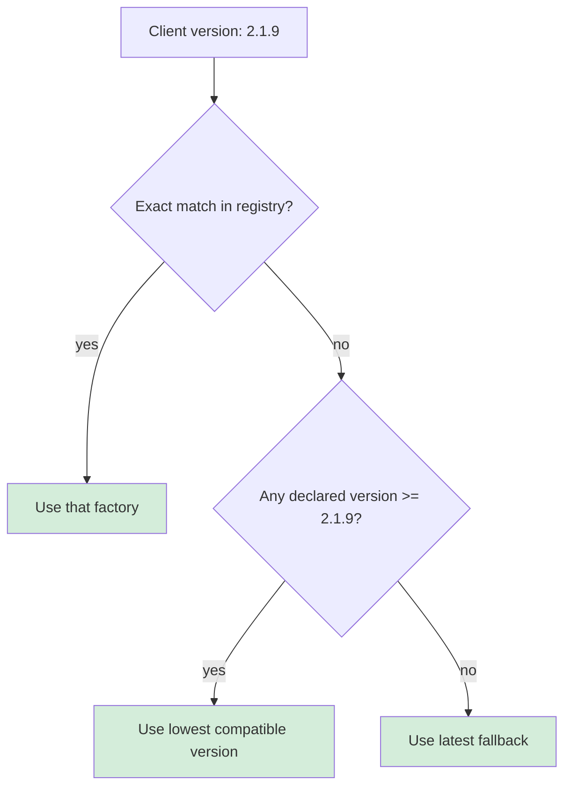

# Versioning Formats

RUF supports two version formats. The format is declared once at the root of the spec YAML and applies consistently across all constructs in the application.

## Formats

### Semantic versioning

```yaml
versioning: semantic
current_version: "2.2.1"
```

The client reports its version as `MAJOR.MINOR.PATCH+BUILD`, e.g. `"2.2.1+5"`. The server parses this into:
- **version**: `"2.2.1"` — used for construct resolution
- **build**: `"5"` — available for logging and diagnostics

Version keys in the spec use `MAJOR.MINOR.PATCH` without the build suffix.

Use semantic versioning when client releases follow a meaningful version scheme and you want to tie specific contract changes to a release number.

### Incremental versioning

```yaml
versioning: incremental
current_version: "42"
```

The client reports its version as a plain integer build number, e.g. `"42"`. The server uses it directly for construct resolution.

Use incremental versioning when clients use monotonic build numbers and the semantic meaning of major/minor/patch is not relevant to the API contract.

---

## Resolution algorithm

When the server receives a request, it resolves each construct's variant using this three-step algorithm:



**Step 1 — Exact match**: If the registry contains an entry for the exact client version (e.g. `"2.1.9"`), use it.

**Step 2 — Lowest compatible**: Find all declared versions greater than or equal to the client version. Use the lowest one. This is the variant designed for the oldest compatible build.

**Step 3 — Latest fallback**: If no declared version is >= the client version, the client is newer than all pinned variants — use the top-level `latest` definition.

### Example

Registry for a `payment_method` component:

```
versions: ["2.1.8", "2.2.0"]
latest: current definition
```

| Client version | Resolution |
|---|---|
| `"2.1.8"` | `"2.1.8"` — exact match |
| `"2.1.9"` | `"2.2.0"` — lowest version >= 2.1.9 |
| `"2.2.0"` | `"2.2.0"` — exact match |
| `"2.2.1"` | `latest` — newer than all pinned versions |
| `"2.1.7"` | `"2.1.8"` — lowest version >= 2.1.7 |

:::tip
The resolution algorithm means you only need to declare a version when the contract changes. Most constructs have no `versions:` entries at all — they just use `latest` for all clients.
:::
