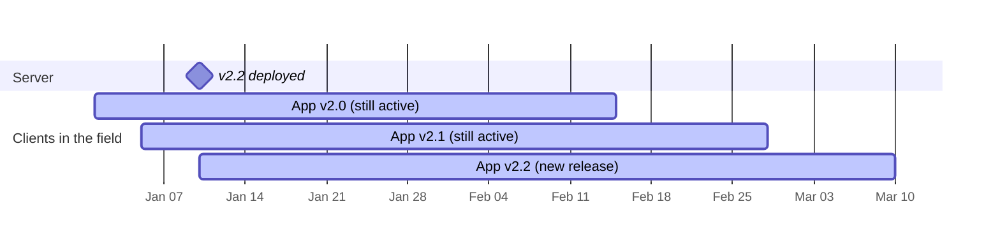

# Why Versioning

RUF versioning exists to solve a fundamental tension in mobile development: the server deploys continuously, but client apps do not.

## The app release cycle problem

When a backend service updates, the change is immediate and universal — all requests from that point forward hit the new code. Mobile apps work differently. A new version submitted to an app store takes time to be reviewed, and once released, users adopt it gradually. Some users never update at all.

This creates a window — often days or weeks, sometimes indefinitely — where multiple versions of the client app are actively in use, all hitting the same server.

Without a versioning strategy, this creates an impossible situation: the server can either stay frozen at the old contract (blocking all improvements) or update freely (breaking old clients).

## How RUF handles it

RUF versioning operates at the construct level. Instead of versioning the entire application, individual components, actions, and metrics each declare version-specific variants. The server selects the correct variant for each request based on the client's reported app version.

This means:

- **Old clients** receive constructs shaped to their expectations
- **New clients** receive the latest definitions
- **Each construct evolves independently** — updating one component's payload doesn't force you to version every other construct

## What gets versioned

RUF supports versioning for:

| What | Why |
|---|---|
| **Components** | Payload or locale shape changed between app versions |
| **Actions** | Payload fields added/removed, or navigation targets changed |
| **Metrics** | Event properties added, renamed, or restructured |
| **SessionMeta** | Fields added or removed from the application's mutable state |

See [Versioning Formats](./versioning-formats) for how version keys are declared and resolved, [Constructs Versioning](./constructs-versioning) for the YAML syntax, and [SessionMeta Versioning](./session-meta-versioning) for how meta migrations work.
